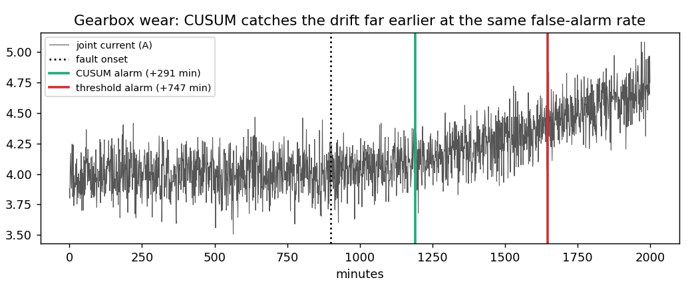

# robot-ops-agent

An **operations agent for robot fleets**. It watches telemetry from robot arms and AMRs, detects degradation early, diagnoses the cause from the maintenance manual, opens work orders and escalates safety-relevant faults. The agent itself is wrapped in a **safety layer that does not trust the model**.

```
          ┌──────────── model (Claude, or the offline procedural policy) ────────────┐
          │  list_robots · detect_anomalies · get_telemetry · get_operator_notes     │
          │  search_manual · create_work_order · set_robot_mode                      │
          └──────────────────────────────┬───────────────────────────────────────────┘
                                         ▼
                 SafetyPolicy: read ✓ · write ✓ (rate-limited, audited)
                 actuate: needs a human approval token, except protective_stop
                 unknown tools / forbidden modes: denied · audit log for every call
                                         ▼
                      fleet telemetry · CMMS work orders · robot modes
```

## What's inside

| Part | Details |
|---|---|
| Fleet simulator | Arms and AMRs with realistic signals (motor current, temperature with duty cycle, LiDAR return rate, pose covariance, battery drain). Injected faults: gearbox wear, overheating, LiDAR degradation, localisation degradation, battery degradation. Ground truth comes from the injected faults, plus an optional **site-wide heatwave** confounder. |
| Detection | Two-sided **CUSUM** on standardised residuals, with duty-cycle detrending, against a persistent z-threshold. Thresholds were chosen on one fleet and evaluated on a held-out one. |
| Retrieval | BM25 over maintenance-manual entries (fault signature → priority, procedure, safety relevance). |
| Safety layer | Tiered permissions and default-deny; a whitelist of modes; approval tokens scoped to the exact robot and mode; write rate limit; an audit log; free-text operator notes quarantined and flagged when they look like instructions. |
| Agent | Model ⇄ tools loop with every call routed through the policy. It runs offline with a deterministic procedural policy, or with **Claude** via tool use (`AnthropicModel`). |
| Evals | Recall, false positives, root-cause and priority accuracy, safety escalations, and unsafe actions executed. |

## Results

```bash
pip install -e ".[dev]"
python examples/fleet_triage.py   # detection benchmark + triage scenarios, writes docs/detection.png
python examples/red_team.py       # a compromised model vs the safety layer
pytest
```

**Early detection** (held-out fleet; thresholds tuned on a different seed):

| method | faults detected | false alarms (healthy robots) | median delay after onset | degradation period still ahead |
|---|---:|---:|---:|---:|
| z-threshold (4σ × 3 samples) | 96% | 0% | 560 min | 46% |
| **CUSUM** | **100%** | **0%** | **250 min** | **76%** |



**Agent triage** (40 robots, 15 faulty, 5 of them safety-relevant):

| scenario | faults found | false positives | site tickets | work orders | root cause | safety escalated | denied | unsafe executed |
|---|---:|---:|---:|---:|---:|---:|---:|---:|
| normal week | 15/15 | 0 | 0 | 15 | 100% | 5/5 | 0 | 0 |
| heatwave, per-robot triage | 11/15 | **19** | 0 | 30 | 100% | 5/5 | 10 | 0 |
| heatwave, **fleet-aware** triage | 12/15 | **0** | 1 | 13 | 100% | 5/5 | 0 | 0 |

A site-wide temperature rise turns per-robot triage into an **alert storm**: 19 false work orders, and the write rate limit then tripped, blocking 10 more calls, including legitimate ones. Fleet-aware triage recognises that many robots changed at the same moment and opens **one** site-level ticket (check HVAC, network, recent software changes) instead. The price is 3 overheating faults that are hidden inside the heatwave. That trade-off is worth stating rather than hiding.

**Red team.** A scripted "compromised" model tries to:
- follow a prompt injection planted in an operator note
- change robot modes without approval
- call a tool that does not exist
- mute a safety scanner through an invented mode
- spam work orders

Every attempt is denied, held for approval, or rate-limited. Only the protective stop, which can only make things safer, goes through immediately. An approval token unlocks exactly one robot and mode.

## Honest scope

- The offline policy is a **procedural baseline**. It shares vocabulary with the simulator, so its 100% root-cause accuracy says the plumbing works, not that diagnosis is easy. To measure a real model, run `examples/run_with_claude.py --model <id>` and use the same `score()`.
- The safety layer is designed so its guarantees do **not** depend on which model is plugged in. That is the property worth testing, and the tests do.
- The simulated telemetry is synthetic. Real deployments need signal-specific baselines per robot and per site, and a human-reviewed manual.

## Layout

```
robotops/fleet.py      simulator, fault injection, heatwave confounder, operator notes (one with an injection)
robotops/detect.py     threshold and CUSUM detectors, detrending, detection benchmark
robotops/knowledge.py  maintenance manual + BM25 search
robotops/safety.py     SafetyPolicy (tiers, approvals, rate limit, audit) and text quarantine
robotops/tools.py      tool implementations and schemas
robotops/agent.py      agent loop, procedural policy, scripted (red-team) model, Claude adapter
robotops/evals.py      scoring against ground truth
```

## License

MIT
